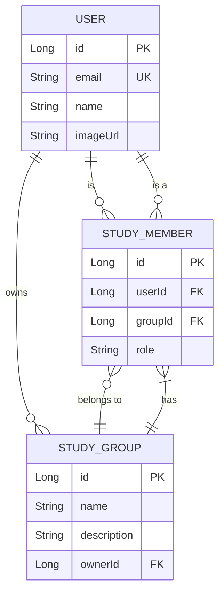

# 06. 데이터베이스 스키마

CoUp 프로젝트의 데이터베이스 스키마는 PostgreSQL을 기반으로 하며, Next.js API Routes는 **Prisma**를 통해 데이터베이스와 상호작용합니다. Prisma는 ORM(Object-Relational Mapper)으로서 데이터베이스 스키마를 정의하고, 타입 안전성을 보장하는 클라이언트를 자동으로 생성하여 데이터 접근을 간소화합니다.

## 1. ERD (Entity-Relationship Diagram)

(데이터베이스의 논리적 구조는 이전과 동일합니다.)



## 2. Prisma Schema 정의 (주요 예시)

- Prisma는 `schema.prisma` 파일에 데이터베이스 스키마를 정의합니다. 이 스키마를 기반으로 Prisma Client가 생성되어 Next.js API Routes에서 타입 안전하게 데이터베이스에 접근할 수 있습니다.

### User 모델 (사용자 데이터 모델)

```prisma
// prisma/schema.prisma
model User {
  id        Int      @id @default(autoincrement())
  email     String   @unique
  name      String
  imageUrl  String?
  role      String   @default("USER") // Enum으로 변경 가능
  createdAt DateTime @default(now())
  updatedAt DateTime @updatedAt

  StudyMember StudyMember[]
  StudyGroup  StudyGroup[]  @relation("Owner")
}

model StudyGroup {
  id          Int      @id @default(autoincrement())
  name        String
  description String
  ownerId     Int
  createdAt   DateTime @default(now())
  updatedAt   DateTime @updatedAt

  owner       User        @relation("Owner", fields: [ownerId], references: [id])
  StudyMember StudyMember[]
}

model StudyMember {
  id        Int      @id @default(autoincrement())
  userId    Int
  groupId   Int
  role      String   @default("MEMBER") // Enum으로 변경 가능
  createdAt DateTime @default(now())
  updatedAt DateTime @updatedAt

  user      User       @relation(fields: [userId], references: [id])
  studyGroup StudyGroup @relation(fields: [groupId], references: [id])

  @@unique([userId, groupId])
}
```

## 3. 모델 설명

- **Prisma Schema**: `schema.prisma` 파일에 데이터베이스의 테이블 구조와 관계를 정의합니다. 각 `model`은 데이터베이스의 테이블에 매핑되며, 필드들은 테이블의 컬럼에 해당합니다.
- **Prisma Client**: `prisma generate` 명령을 실행하면 `schema.prisma` 파일을 기반으로 타입스크립트 클라이언트 라이브러리가 자동으로 생성됩니다. 이 클라이언트를 통해 Next.js API Routes에서 데이터베이스 CRUD 작업을 타입 안전하게 수행할 수 있습니다.
- **관계 정의**: `@relation` 어노테이션을 사용하여 모델 간의 관계(1:N, N:M 등)를 명시적으로 정의합니다. Prisma는 이 정보를 바탕으로 관계형 데이터를 쉽게 쿼리할 수 있는 API를 제공합니다.
- **마이그레이션**: Prisma Migrate를 사용하여 스키마 변경 사항을 데이터베이스에 적용하고 버전 관리를 할 수 있습니다.