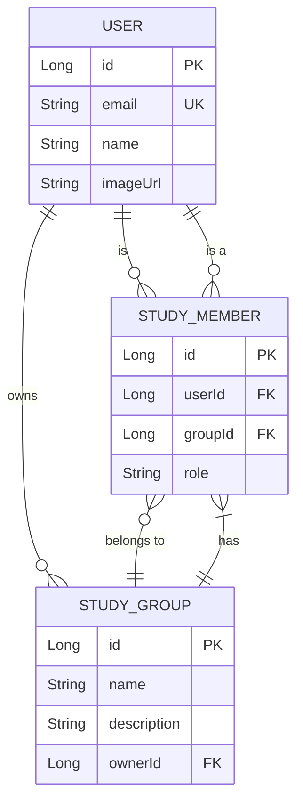

# 06. 데이터베이스 스키마

CoUp 프로젝트의 데이터베이스 스키마는 PostgreSQL을 기반으로 하며, 백엔드 애플리케이션은 **MyBatis**를 통해 데이터베이스와 상호작용합니다. MyBatis는 SQL 쿼리를 자바 코드로부터 분리하여 XML 파일이나 어노테이션에 명시하고, 이를 자바 객체(DTO)에 매핑하는 방식으로 동작합니다.

## 1. ERD (Entity-Relationship Diagram)

(데이터베이스의 논리적 구조는 이전과 동일합니다.)



## 2. DTO 및 MyBatis 매퍼 정의 ( 주요 예시 )

- MyBatis는 데이터베이스 테이블의 데이터를 전달하기 위한 객체로 DTO(Data Transfer Object) 또는 VO(Value Object)를 사용합니다.

### UserDto (사용자 데이터 객체)

```java
// com.coup.domain.user.dto.UserDto.java
@Getter
@Setter // MyBatis가 결과를 매핑하기 위해 Setter가 필요할 수 있음
public class UserDto {
    private Long id;
    private String email;
    private String name;
    private String imageUrl;
    private String role;
    private LocalDateTime createdAt;
    private LocalDateTime updatedAt;
}
```

### UserMapper (사용자 매퍼 인터페이스)

- SQL 쿼리는 매퍼 인터페이스의 메서드에 어노테이션으로 직접 작성하거나, 별도의 XML 파일에 분리하여 작성할 수 있습니다. 여기서는 어노테이션 방식을 예시로 사용합니다.

```java
// com.coup.domain.user.UserRepository.java (또는 UserMapper.java)
@Mapper
public interface UserRepository {

    @Select("SELECT * FROM users WHERE id = #{id}")
    Optional<UserDto> findById(Long id);

    @Select("SELECT * FROM users WHERE email = #{email}")
    Optional<UserDto> findByEmail(String email);

    @Insert("INSERT INTO users (email, name, image_url, role, created_at, updated_at) " +
            "VALUES (#{email}, #{name}, #{imageUrl}, #{role}, NOW(), NOW())")
    @Options(useGeneratedKeys = true, keyProperty = "id")
    void insert(UserDto user);

    @Update("UPDATE users SET name = #{name}, image_url = #{imageUrl}, updated_at = NOW() " +
            "WHERE id = #{id}")
    void update(UserDto user);
}
```

## 3. 모델 설명

- **DTO (Data Transfer Object)**: 데이터베이스의 테이블 구조와 유사한 형태를 가진 순수 자바 객체(POJO)입니다. 각 계층 간에 데이터를 전달하는 목적으로 사용되며, MyBatis는 SQL 쿼리 결과를 이 DTO 객체에 매핑하여 반환합니다.
- **`@Mapper`**: 이 인터페이스가 MyBatis의 매퍼임을 나타냅니다. Spring Boot는 이 어노테이션을 감지하여 해당 인터페이스의 구현체를 자동으로 생성하고 빈(Bean)으로 등록합니다.
- **`@Select`, `@Insert`, `@Update`, `@Delete`**: 매퍼 인터페이스의 각 메서드에 실행할 SQL 쿼리를 직접 매핑하는 어노테이션입니다. `#{...}` 구문은 파라미터가 바인딩될 위치를 나타냅니다.
- **`@Options`**: `@Insert`나 `@Update` 문에서 자동 생성된 키(Auto-increment)를 가져오거나 다른 설정을 지정할 때 사용합니다.
- **XML 매퍼**: 복잡한 동적 쿼리(조건에 따라 SQL이 변경되는 경우)를 작성해야 할 경우, 어노테이션 방식 대신 XML 파일을 사용하여 SQL을 더 유연하게 관리할 수 있습니다.