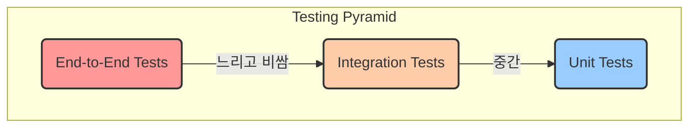

# 13. 테스트 전략

CoUp 프로젝트는 **높은 코드 품질**과 **안정적인 서비스 운영**을 최우선 목표로 삼습니다. 이를 위해 프론트엔드, 백엔드, 시그널링 서버 각 스택에 맞는 자동화된 테스트를 적극적으로 도입하여, 코드의 신뢰도를 높이고 회귀 오류를 방지합니다.

## 1. 테스트 피라미드 (Testing Pyramid)

프론트엔드 (Next.js)와 백엔드 (Next.js API Routes) 모두 전통적인 테스트 피라미드 모델을 따릅니다. 빠르고 비용이 저렴한 단위 테스트를 가장 많이, 느리고 비용이 비싼 E2E 테스트를 가장 적게 작성하는 전략입니다.



--- 

## 2. Next.js 풀스택 테스트 (Frontend & API Routes)

### 2.1. 단위/통합 테스트 (Frontend Components)

- **도구**: **Jest** + **React Testing Library (RTL)**
- **전략**: 컴포넌트의 동작을 검증하고, UI 상호작용 및 상태 변화를 테스트합니다.

**예시 (React 컴포넌트 테스트)**
```javascript
// Button.test.tsx
import { render, screen, fireEvent } from '@testing-library/react';
import { Button } from './Button';

describe('Button', () => {
  it('calls onClick handler when clicked', () => {
    const handleClick = jest.fn();
    render(<Button onClick={handleClick}>Click me</Button>);
    fireEvent.click(screen.getByRole('button'));
    expect(handleClick).toHaveBeenCalledTimes(1);
  });
});
```

### 2.2. 단위/통합 테스트 (API Routes)

- **도구**: **Jest** + **Supertest**
- **전략**: Next.js API Routes의 핸들러 함수를 직접 테스트하여, 요청 처리, 비즈니스 로직, 데이터베이스 상호작용 (Prisma Client Mocking) 등을 검증합니다.

**예시 (API Route 테스트)**
```javascript
// pages/api/v1/users.test.ts (또는 app/api/v1/users/route.test.ts)
import { createRequest, createResponse } from 'node-mocks-http';
import handler from './route'; // API Route 핸들러 임포트
import prisma from '@/lib/db/prisma'; // Prisma Client

// Prisma Client Mocking
jest.mock('@/lib/db/prisma', () => ({
  user: {
    findMany: jest.fn(),
    create: jest.fn(),
  },
}));

describe('GET /api/v1/users', () => {
  it('should return a list of users', async () => {
    const mockUsers = [{ id: 1, name: 'Test User' }];
    (prisma.user.findMany as jest.Mock).mockResolvedValue(mockUsers);

    const req = createRequest({ method: 'GET' });
    const res = createResponse();

    await handler(req, res);

    expect(res._getStatusCode()).toBe(200);
    expect(res._getJSONData()).toEqual(mockUsers);
    expect(prisma.user.findMany).toHaveBeenCalledTimes(1);
  });
});
```

### 2.3. E2E (End-to-End) 테스트

- **도구**: **Cypress** 또는 **Playwright**
- **전략**: 실제 사용자의 입장에서 회원가입, 스터디 생성 등 핵심적인 시나리오가 전체 시스템(Next.js 풀스택 + 시그널링)을 관통하며 문제없이 동작하는지 검증합니다.

---

## 3. 시그널링 서버 테스트 (Node.js)

- **도구**: **Jest** + **Socket.IO Client**
- **전략**: 실제 WebSocket 서버를 실행하고, 테스트 코드에서 클라이언트가 되어 연결한 후 이벤트를 주고받으며 서버 로직을 검증합니다.

(예시 코드는 이전 버전과 동일...)

---

## 4. 테스트 실행

- **Next.js 풀스택**: `frontend` 디렉토리에서 `npm test` 실행.
- **시그널링 서버**: `signaling` 디렉토리에서 `npm test` 실행.
- **CI 환경**: GitHub Actions를 통해 Pull Request 생성 시, 변경된 각 프로젝트의 테스트가 자동으로 실행됩니다.
