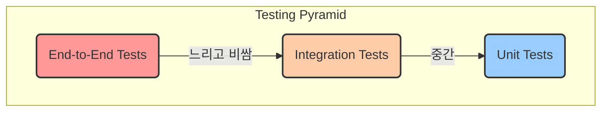

# 13. 테스트 전략

CoUp 프로젝트는 **높은 코드 품질**과 **안정적인 서비스 운영**을 최우선 목표로 삼습니다. 이를 위해 프론트엔드, 백엔드, 시그널링 서버 각 스택에 맞는 자동화된 테스트를 적극적으로 도입하여, 코드의 신뢰도를 높이고 회귀 오류를 방지합니다.

## 1. 테스트 피라미드 (Testing Pyramid)

프론트엔드와 백엔드 모두 전통적인 테스트 피라미드 모델을 따릅니다. 빠르고 비용이 저렴한 단위 테스트를 가장 많이, 느리고 비용이 비싼 E2E 테스트를 가장 적게 작성하는 전략입니다.



--- 

## 2. 프론트엔드 테스트 (JavaScript/React)

### 2.1. 단위/통합 테스트

- **도구**: **Jest** + **React Testing Library (RTL)**
- **전략**: 단위/통합 테스트를 통해 컴포넌트의 동작을 검증하고, API 호출이 포함된 흐름의 경우 실제 백엔드 개발 서버를 실행하여 테스트합니다.

**예시 (React 컴포넌트 테스트)**
```javascript
// Button.test.jsx
import { render, screen, fireEvent } from '@testing-library/react';
import { Button } from './Button';

describe('Button', () => {
  it('calls onClick handler when clicked', () => {
    const handleClick = jest.fn();
    render(<Button onClick={handleClick}>Click me</Button>);
    fireEvent.click(screen.getByRole('button'));
    expect(handleClick).toHaveBeenCalledTimes(1);
  });
});
```

### 2.2. E2E (End-to-End) 테스트

- **도구**: **Cypress** 또는 **Playwright**
- **전략**: 실제 사용자의 입장에서 회원가입, 스터디 생성 등 핵심적인 시나리오가 전체 시스템(프론트엔드+백엔드+시그널링)을 관통하며 문제없이 동작하는지 검증합니다.

---

## 3. 비즈니스 서버 테스트 (Java/Spring Boot)

### 3.1. 단위 테스트 (Unit Tests)

- **목표**: 특정 클래스(주로 Service 계층)의 비즈니스 로직을 주변 의존성을 모두 격리(Mocking)한 채 독립적으로 검증합니다.
- **도구**: **JUnit 5** + **Mockito**
- **전략**: `@ExtendWith(MockitoExtension.class)`를 사용하여 Mockito를 활성화하고, `@Mock`으로 의존관계(Mapper 등)를 가짜 객체로 만듭니다. `@InjectMocks`를 사용하여 테스트 대상 클래스에 Mock 객체를 주입합니다.

**예시 (Service 단위 테스트)**
```java
// StudyServiceTest.java
@ExtendWith(MockitoExtension.class)
class StudyServiceTest {

    @InjectMocks
    private StudyService studyService;

    @Mock
    private StudyRepository studyRepository; // MyBatis Mapper 인터페이스

    @Test
    void createStudy_success() {
        // given
        UserDto owner = new UserDto(...);
        StudyCreationRequest request = new StudyCreationRequest("New Study", ...);
        doNothing().when(studyRepository).insert(any(StudyDto.class));

        // when
        StudyResponse response = studyService.createStudy(owner, request);

        // then
        assertThat(response.getName()).isEqualTo("New Study");
        verify(studyRepository, times(1)).insert(any(StudyDto.class));
    }
}
```

### 3.2. 통합 테스트 (Integration Tests)

- **목표**: MyBatis 매퍼(Mapper)가 SQL 쿼리를 정확하게 실행하고, 데이터베이스와 올바르게 상호작용하는지 검증합니다.
- **도구**: **`@MybatisTest`** + **Testcontainers** 또는 **H2 Database**
  - **`@MybatisTest`**: MyBatis 매퍼들을 테스트하는 데 특화된 어노테이션입니다. 매퍼들만 빈으로 등록하여 가볍고 빠른 통합 테스트 환경을 제공합니다.
  - **Testcontainers**: 테스트 실행 시 Docker 컨테이너로 실제와 동일한 버전의 PostgreSQL을 띄워 테스트의 신뢰도를 극대화합니다. (권장)

**예시 (MyBatis 매퍼 통합 테스트)**
```java
// UserRepositoryTest.java
@MybatisTest
@AutoConfigureTestDatabase(replace = AutoConfigureTestDatabase.Replace.NONE) // 내장 DB 대신 Testcontainers 사용 시
class UserRepositoryTest {

    @Autowired
    private UserRepository userRepository;

    @Test
    void findByEmail_success() {
        // given: 테스트 데이터 미리 삽입 (sql 스크립트 또는 직접 insert)
        UserDto newUser = new UserDto();
        newUser.setEmail("test@example.com");
        newUser.setName("Test User");
        userRepository.insert(newUser);

        // when
        Optional<UserDto> foundUser = userRepository.findByEmail("test@example.com");

        // then
        assertThat(foundUser).isPresent();
        assertThat(foundUser.get().getName()).isEqualTo("Test User");
    }
}
```

---

## 4. 시그널링 서버 테스트 (Node.js)

- **도구**: **Jest** + **Socket.IO Client**
- **전략**: 실제 WebSocket 서버를 실행하고, 테스트 코드에서 클라이언트가 되어 연결한 후 이벤트를 주고받으며 서버 로직을 검증합니다.

(예시 코드는 이전 버전과 동일...)

---

## 5. 테스트 실행

- **프론트엔드**: `frontend` 디렉토리에서 `npm test` 실행.
- **백엔드**: `backend` 디렉토리에서 `./gradlew test` 실행.
- **시그널링 서버**: `signaling` 디렉토리에서 `npm test` 실행.
- **CI 환경**: GitHub Actions를 통해 Pull Request 생성 시, 변경된 각 프로젝트의 테스트가 자동으로 실행됩니다.
