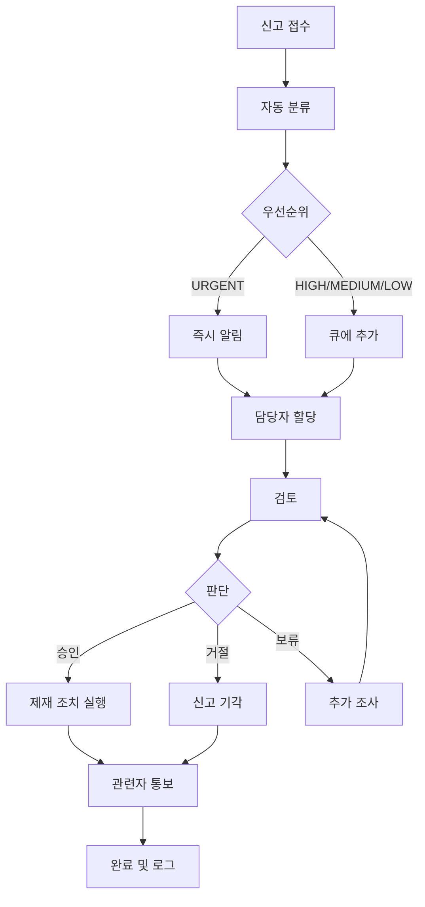

# CoUp 플랫폼 - 통합 관리자 시스템 설계

> **작성일**: 2025-11-27  
> **목적**: 일반 사용자 기능 분석과 모범 사례를 통합하여 CoUp에 최적화된 관리자 시스템 설계  
> **참조 문서**: `01-user-features-analysis.md`, `02-admin-system-best-practices.md`

---

## 📋 목차

1. [시스템 개요](#1-시스템-개요)
2. [관리자 역할 및 권한 체계](#2-관리자-역할-및-권한-체계)
3. [핵심 기능 영역](#3-핵심-기능-영역)
4. [기술 아키텍처](#4-기술-아키텍처)
5. [구현 로드맵](#5-구현-로드맵)
6. [보안 및 모니터링](#6-보안-및-모니터링)

---

## 1. 시스템 개요

### 1.1 관리자 시스템의 목적

CoUp 관리자 시스템은 **건강한 학습 커뮤니티 생태계 유지**를 위해 다음 목표를 달성합니다:

1. **커뮤니티 안전 보장**: 부적절한 사용자 및 콘텐츠 제재
2. **서비스 품질 관리**: 스터디 품질 유지 및 우수 사례 발굴
3. **사용자 분쟁 해결**: 신고 처리 및 중재
4. **시스템 안정성 유지**: 서비스 모니터링 및 최적화
5. **데이터 기반 의사결정**: 통계 분석 및 인사이트 도출

---

### 1.2 관리 대상 범위

```
┌─────────────────────────────────────────────────────┐
│                   CoUp 플랫폼                        │
├─────────────────────────────────────────────────────┤
│                                                     │
│  👥 사용자 (Users)                                  │
│  ├─ 계정 상태 관리 (활성/정지/삭제)                │
│  ├─ 역할 관리 (USER/ADMIN/SYSTEM_ADMIN)            │
│  └─ 제재 이력 추적                                  │
│                                                     │
│  📚 스터디 (Studies)                                │
│  ├─ 스터디 생명주기 관리                           │
│  ├─ 품질 관리 (저품질 스터디 탐지)                 │
│  └─ 추천 스터디 큐레이션                           │
│                                                     │
│  💬 콘텐츠 (Content)                                │
│  ├─ 메시지 모더레이션                              │
│  ├─ 파일 관리 (저작권, 악성파일)                   │
│  └─ 공지사항 관리                                  │
│                                                     │
│  🚨 신고 (Reports)                                  │
│  ├─ 신고 접수 및 분류                              │
│  ├─ 처리 워크플로우                                │
│  └─ 제재 조치 실행                                 │
│                                                     │
│  ⚙️ 시스템 (System)                                │
│  ├─ 전역 설정 관리                                 │
│  ├─ 기능 토글 (점검 모드 등)                       │
│  └─ 감사 로그                                      │
│                                                     │
└─────────────────────────────────────────────────────┘
```

---

## 2. 관리자 역할 및 권한 체계

### 2.1 역할 정의

#### SYSTEM_ADMIN (시스템 관리자)
**설명**: 플랫폼 전체에 대한 최고 권한을 가진 관리자

**책임**:
- 시스템 전역 설정 관리
- 관리자 임명 및 해임
- 데이터베이스 직접 관리
- 백업 및 복구
- 법적 요청 대응

**인원**: 1-3명 (창업자, CTO 등)

---

#### ADMIN (일반 관리자)
**설명**: 일상적인 운영 업무를 담당하는 관리자

**책임**:
- 사용자 신고 처리
- 콘텐츠 모더레이션
- 스터디 품질 관리
- 통계 분석 및 리포트

**인원**: 5-10명 (커뮤니티 매니저, 모더레이터)

---

### 2.2 권한 매트릭스

| 기능 분류 | 세부 기능 | ADMIN | SYSTEM_ADMIN |
|----------|----------|-------|--------------|
| **사용자 관리** | 사용자 조회 | ✅ | ✅ |
| | 사용자 검색 | ✅ | ✅ |
| | 계정 정지 | ✅ | ✅ |
| | 정지 해제 | ✅ | ✅ |
| | 기능 제한 | ✅ | ✅ |
| | 계정 삭제 | ❌ | ✅ |
| | 역할 변경 | ❌ | ✅ |
| | 관리자 임명 | ❌ | ✅ |
| **스터디 관리** | 스터디 조회 | ✅ | ✅ |
| | 스터디 검색 | ✅ | ✅ |
| | 스터디 삭제 | ✅ | ✅ |
| | 스터디 비공개 전환 | ✅ | ✅ |
| | 추천 스터디 설정 | ✅ | ✅ |
| | OWNER 권한 위임 | ❌ | ✅ |
| **신고 관리** | 신고 조회 | ✅ | ✅ |
| | 신고 처리 | ✅ | ✅ |
| | 신고 담당자 할당 | ✅ | ✅ |
| | 제재 조치 실행 | ✅ | ✅ |
| **콘텐츠 관리** | 메시지 조회 | ✅ | ✅ |
| | 메시지 삭제 | ✅ | ✅ |
| | 파일 조회 | ✅ | ✅ |
| | 파일 삭제 | ✅ | ✅ |
| | 자동 필터 설정 | ❌ | ✅ |
| **통계 분석** | 대시보드 조회 | ✅ | ✅ |
| | 사용자 통계 | ✅ | ✅ |
| | 스터디 통계 | ✅ | ✅ |
| | 신고 통계 | ✅ | ✅ |
| | 리포트 생성 | ✅ | ✅ |
| **시스템 설정** | 시스템 설정 조회 | ❌ | ✅ |
| | 시스템 설정 변경 | ❌ | ✅ |
| | 기능 토글 | ❌ | ✅ |
| | 감사 로그 조회 | ❌ | ✅ |
| | 백업/복구 | ❌ | ✅ |
| | 데이터 내보내기 | ❌ | ✅ |

---

### 2.3 권한 검사 시스템

#### 미들웨어 구현
```javascript
// lib/adminAuth.js

// 관리자 권한 필요
export async function requireAdmin(request) {
  const session = await auth();
  
  if (!session) {
    return NextResponse.json(
      { error: '인증이 필요합니다' },
      { status: 401 }
    );
  }
  
  if (!['ADMIN', 'SYSTEM_ADMIN'].includes(session.user.role)) {
    await logSecurityEvent({
      type: 'UNAUTHORIZED_ACCESS_ATTEMPT',
      userId: session.user.id,
      path: request.url,
    });
    
    return NextResponse.json(
      { error: '관리자 권한이 필요합니다' },
      { status: 403 }
    );
  }
  
  return session;
}

// 시스템 관리자 권한 필요
export async function requireSystemAdmin(request) {
  const session = await auth();
  
  if (!session || session.user.role !== 'SYSTEM_ADMIN') {
    await logSecurityEvent({
      type: 'UNAUTHORIZED_SYSTEM_ADMIN_ACCESS',
      userId: session?.user?.id,
      path: request.url,
    });
    
    return NextResponse.json(
      { error: '시스템 관리자 권한이 필요합니다' },
      { status: 403 }
    );
  }
  
  return session;
}

// 특정 권한 검사
export function hasPermission(session, permission) {
  const PERMISSIONS = {
    'user.delete': ['SYSTEM_ADMIN'],
    'user.suspend': ['ADMIN', 'SYSTEM_ADMIN'],
    'study.delete': ['ADMIN', 'SYSTEM_ADMIN'],
    'system.settings': ['SYSTEM_ADMIN'],
    // ... 추가 권한
  };
  
  const allowedRoles = PERMISSIONS[permission];
  return allowedRoles?.includes(session.user.role);
}
```

---

## 3. 핵심 기능 영역

### 3.1 대시보드 (Dashboard)

#### 목적
관리자가 플랫폼의 전체 상태를 **한눈에 파악**하고 **긴급 이슈에 즉각 대응**

#### 핵심 구성 요소

**1. 핵심 지표 카드 (4개)**
```javascript
{
  totalUsers: 1250,        // 총 사용자 수
  activeStudies: 85,       // 활성 스터디 수
  pendingReports: 12,      // 미처리 신고
  dau: 456,                // 오늘 DAU
}
```

**2. 실시간 활동 그래프**
- 시간대별 활성 사용자 (24시간)
- 일일 가입자 추이 (7일)
- 스터디 생성 추이 (7일)

**3. 긴급 알림**
```javascript
[
  {
    type: 'URGENT_REPORT',
    priority: 'URGENT',
    message: 'HARASSMENT 신고 3건 처리 대기',
    count: 3,
    link: '/admin/reports?priority=URGENT'
  },
  {
    type: 'SYSTEM_ERROR',
    priority: 'HIGH',
    message: '파일 업로드 실패 증가',
    count: 15,
    link: '/admin/analytics/errors'
  }
]
```

**4. 최근 관리자 활동 로그**
```javascript
[
  {
    admin: '홍길동',
    action: '사용자 정지',
    target: 'user123',
    reason: '반복적인 욕설 사용',
    time: '10분 전'
  },
  // ... 최근 10건
]
```

#### API 엔드포인트
```
GET /api/admin/dashboard
- 핵심 지표, 그래프 데이터, 긴급 알림 반환
- 1분 캐싱 적용
```

---

### 3.2 사용자 관리 (User Management)

#### 3.2.1 사용자 목록 페이지

**검색 및 필터**
```javascript
// 검색 옵션
{
  query: 'user@example.com',      // 이메일, 이름, ID
  role: 'USER',                   // USER, ADMIN, SYSTEM_ADMIN
  status: 'ACTIVE',               // ACTIVE, SUSPENDED, DELETED
  dateFrom: '2025-01-01',         // 가입일 시작
  dateTo: '2025-11-27',           // 가입일 종료
  sortBy: 'createdAt',            // createdAt, lastLoginAt, studyCount
  sortOrder: 'desc',              // asc, desc
  page: 1,
  limit: 20
}
```

**사용자 목록 테이블**
```
┌─────────────────────────────────────────────────────────────┐
│ [검색창] [필터 버튼] [내보내기]                             │
├────┬──────────┬─────────┬────────┬──────────┬──────────────┤
│ 선택│  이름    │  이메일  │  역할  │   상태   │   액션       │
├────┼──────────┼─────────┼────────┼──────────┼──────────────┤
│ □  │ 홍길동   │ hong@.. │ USER   │ ACTIVE   │ [상세][정지] │
│ □  │ 김철수   │ kim@... │ ADMIN  │ ACTIVE   │ [상세][편집] │
│ □  │ 이영희   │ lee@... │ USER   │SUSPENDED │ [상세][해제] │
└────┴──────────┴─────────┴────────┴──────────┴──────────────┘
[일괄 선택] [일괄 메시지 발송] [CSV 내보내기]
```

#### 3.2.2 사용자 상세 페이지

**레이아웃**
```
┌─────────────────────────────────────────────────────────────┐
│ ← 뒤로가기         사용자 상세: hong@example.com            │
├────────────────────────────┬────────────────────────────────┤
│                            │                                │
│  [기본 정보]               │  [빠른 액션]                   │
│  - 이름: 홍길동            │  [경고 발송]                   │
│  - 이메일: hong@...        │  [3일 정지]                    │
│  - 가입일: 2025-10-01      │  [7일 정지]                    │
│  - 마지막 로그인: 1시간 전 │  [기능 제한]                   │
│                            │  [메시지 보내기]               │
│  [활동 통계]               │  [역할 변경] (SYSTEM_ADMIN만)  │
│  - 참여 스터디: 5개        │                                │
│  - 메시지 발송: 1,234건    │                                │
│  - 파일 업로드: 45개       │                                │
│                            │                                │
│  [제재 이력]               │                                │
│  📋 2025-10-15: 3일 정지   │                                │
│     사유: 스팸 발송        │                                │
│  ⚠️ 2025-09-20: 경고       │                                │
│     사유: 부적절한 언어    │                                │
│                            │                                │
│  [신고 이력]               │                                │
│  - 신고한 횟수: 2회        │                                │
│  - 신고당한 횟수: 5회      │                                │
│                            │                                │
└────────────────────────────┴────────────────────────────────┘
```

#### 3.2.3 제재 시스템

**3-Strike 시스템**
```javascript
// 제재 단계 자동 결정
function determineSanctionLevel(userId) {
  const sanctions = getUserSanctions(userId);
  const warningCount = sanctions.filter(s => s.type === 'WARNING').length;
  const suspensionCount = sanctions.filter(s => s.type === 'SUSPEND').length;
  
  if (warningCount === 0) {
    return { type: 'WARNING', duration: null };
  } else if (warningCount === 1 && suspensionCount === 0) {
    return { type: 'SUSPEND', duration: '3일' };
  } else if (suspensionCount === 1) {
    return { type: 'SUSPEND', duration: '7일' };
  } else if (suspensionCount === 2) {
    return { type: 'SUSPEND', duration: '30일' };
  } else {
    return { type: 'SUSPEND', duration: '영구' };
  }
}
```

**제재 실행 모달**
```javascript
// 제재 실행 UI
<SanctionModal>
  <h3>사용자 정지</h3>
  
  <div>대상: hong@example.com</div>
  
  <select name="duration">
    <option value="1일">1일</option>
    <option value="3일" selected>3일 (권장)</option>
    <option value="7일">7일</option>
    <option value="30일">30일</option>
    <option value="영구">영구</option>
  </select>
  
  <textarea name="reason" required>
    반복적인 욕설 사용으로 커뮤니티 가이드라인 위반
  </textarea>
  
  <label>
    <input type="checkbox" name="notify" checked />
    사용자에게 이메일 알림 발송
  </label>
  
  <button type="submit">정지 실행</button>
</SanctionModal>
```

#### API 엔드포인트
```
GET    /api/admin/users                    # 사용자 목록
GET    /api/admin/users/:id                # 사용자 상세
POST   /api/admin/users/:id/suspend        # 계정 정지
POST   /api/admin/users/:id/unsuspend      # 정지 해제
POST   /api/admin/users/:id/restrict       # 기능 제한
PATCH  /api/admin/users/:id/role           # 역할 변경 (SYSTEM_ADMIN)
DELETE /api/admin/users/:id                # 계정 삭제 (SYSTEM_ADMIN)
```

---

### 3.3 스터디 관리 (Study Management)

#### 3.3.1 스터디 목록 페이지

**검색 및 필터**
```javascript
{
  query: '프로그래밍',               // 스터디 이름, 설명
  category: '프로그래밍',            // 카테고리
  isPublic: true,                   // 공개/비공개
  isRecruiting: true,               // 모집 중
  minMembers: 5,                    // 최소 멤버 수
  maxMembers: 20,                   // 최대 멤버 수
  minRating: 4.0,                   // 최소 평점
  sortBy: 'createdAt',              // createdAt, memberCount, rating
  sortOrder: 'desc'
}
```

**스터디 목록 테이블**
```
┌─────────────────────────────────────────────────────────────┐
│ [검색창] [카테고리 필터] [상태 필터]                        │
├────┬──────────┬────────┬────────┬──────┬──────────┬────────┤
│ 선택│ 스터디명  │ OWNER  │ 멤버수 │ 평점 │  상태    │  액션  │
├────┼──────────┼────────┼────────┼──────┼──────────┼────────┤
│ □  │ 자바스터디│홍길동  │ 15/20  │ 4.5  │ 공개     │[상세]  │
│ □  │ 영어회화  │김철수  │ 8/10   │ 4.2  │ 모집완료 │[상세]  │
│ □  │ 의심스터디│이영희  │ 1/50   │ 0.0  │ 공개     │[신고]  │
└────┴──────────┴────────┴────────┴──────┴──────────┴────────┘
```

#### 3.3.2 스터디 상세 페이지

**레이아웃**
```
┌─────────────────────────────────────────────────────────────┐
│ ← 뒤로가기         스터디 상세: 자바 스터디 모임            │
├────────────────────────────┬────────────────────────────────┤
│ [기본 정보]                │  [빠른 액션]                   │
│ - 이름: 자바 스터디        │  [비공개 전환]                 │
│ - OWNER: 홍길동            │  [스터디 삭제]                 │
│ - 카테고리: 프로그래밍     │  [추천 스터디 설정]            │
│ - 멤버: 15/20              │  [OWNER에게 메시지]            │
│ - 평점: 4.5 (10개 리뷰)   │                                │
│ - 생성일: 2025-09-01       │                                │
│                            │  [관리자 메모]                 │
│ [활동 통계]                │  [텍스트 입력창]               │
│ - 총 메시지: 1,250건       │  "2025-11-20: 우수 스터디      │
│ - 총 파일: 45개            │   추천 대상으로 선정"          │
│ - 평균 출석률: 85%         │                                │
│ - 할일 완료율: 75%         │                                │
│                            │                                │
│ [멤버 목록] (상위 5명)     │                                │
│ 1. 홍길동 (OWNER) - 90%    │                                │
│ 2. 김철수 (ADMIN) - 85%    │                                │
│ 3. 이영희 (MEMBER) - 80%   │                                │
│ [전체 멤버 보기]           │                                │
│                            │                                │
│ [신고 이력]                │                                │
│ - 신고 접수: 0건           │                                │
│                            │                                │
│ [관리자 조치 이력]         │                                │
│ - 조치 없음                │                                │
└────────────────────────────┴────────────────────────────────┘
```

#### 3.3.3 스터디 품질 관리

**저품질 스터디 자동 감지**
```javascript
// 품질 점수 계산
function calculateStudyQualityScore(study) {
  let score = 100;
  
  // 활동도 평가
  const daysSinceLastActivity = getDaysSince(study.lastActivityAt);
  if (daysSinceLastActivity > 30) score -= 30;
  else if (daysSinceLastActivity > 14) score -= 15;
  
  // 멤버 참여율
  const memberFillRate = study.memberCount / study.maxMembers;
  if (memberFillRate < 0.3) score -= 20;
  
  // 평점
  if (study.rating < 2.0) score -= 25;
  else if (study.rating < 3.0) score -= 15;
  
  // 신고 이력
  score -= study.reportCount * 10;
  
  return Math.max(score, 0);
}

// 저품질 스터디 필터
const lowQualityStudies = studies.filter(s => 
  calculateStudyQualityScore(s) < 50
);
```

**우수 스터디 추천 기준**
```javascript
// 추천 스터디 선정
function isRecommendableStudy(study) {
  return (
    study.rating >= 4.0 &&
    study.reviewCount >= 5 &&
    study.memberCount >= study.maxMembers * 0.7 &&
    study.avgAttendanceRate >= 0.8 &&
    study.reportCount === 0
  );
}
```

#### API 엔드포인트
```
GET    /api/admin/studies                    # 스터디 목록
GET    /api/admin/studies/:id                # 스터디 상세
DELETE /api/admin/studies/:id                # 스터디 삭제
PATCH  /api/admin/studies/:id/visibility     # 공개/비공개 전환
POST   /api/admin/studies/:id/feature        # 추천 스터디 설정
POST   /api/admin/studies/:id/transfer-owner # OWNER 권한 위임 (SYSTEM_ADMIN)
GET    /api/admin/studies/low-quality        # 저품질 스터디 목록
```

---

### 3.4 신고 관리 (Report Management)

#### 3.4.1 신고 목록 페이지

**필터 옵션**
```javascript
{
  status: 'PENDING',              // PENDING, IN_PROGRESS, RESOLVED, REJECTED
  priority: 'HIGH',               // LOW, MEDIUM, HIGH, URGENT
  type: 'HARASSMENT',             // SPAM, HARASSMENT, INAPPROPRIATE, COPYRIGHT, OTHER
  targetType: 'USER',             // USER, STUDY, MESSAGE
  assignedTo: 'admin123',         // 담당자 ID
  dateFrom: '2025-11-01',
  dateTo: '2025-11-27'
}
```

**신고 목록 (카드 형식)**
```
┌─────────────────────────────────────────────────────────────┐
│ [필터] PENDING | HIGH | HARASSMENT                          │
├─────────────────────────────────────────────────────────────┤
│ 🔴 URGENT | #12345 | 2시간 전                              │
│ 유형: HARASSMENT (괴롭힘)                                   │
│ 대상: 사용자 user123                                        │
│ 신고자: reporter456                                         │
│ 내용: "반복적인 욕설 및 협박 메시지 발송..."               │
│ [상세보기] [빠른 처리: 승인 | 거절]                        │
├─────────────────────────────────────────────────────────────┤
│ 🟠 HIGH | #12344 | 5시간 전                                │
│ 유형: INAPPROPRIATE (부적절한 콘텐츠)                      │
│ 대상: 메시지 msg_abc123                                    │
│ 신고자: reporter789                                         │
│ 내용: "음란물 링크 공유..."                                │
│ [상세보기] [담당자 할당]                                    │
└─────────────────────────────────────────────────────────────┘
```

#### 3.4.2 신고 상세 페이지

**3단 레이아웃**
```
┌─────────────────────────────────────────────────────────────┐
│ ← 신고 목록으로     신고 #12345 처리                        │
├──────────────────────┬──────────────────────┬───────────────┤
│ [신고 정보]          │ [증거 자료]          │ [처리 액션]   │
│                      │                      │               │
│ 신고 ID: #12345      │ 📷 스크린샷1.png     │ 우선순위: HIGH│
│ 신고자: reporter456  │ 📷 스크린샷2.png     │               │
│ 생성일: 2시간 전     │ 📄 증거문서.pdf      │ 담당자:       │
│ 우선순위: HIGH       │                      │ [나에게 할당] │
│ 상태: PENDING        │ [증거 추가]          │               │
│                      │                      │ ─────────────│
│ ──────────────────── │ ──────────────────── │ 추천 조치:    │
│ [대상 정보]          │ [피신고자 이력]      │ ⚠️ 7일 정지   │
│                      │                      │               │
│ 유형: USER           │ 경고: 2회            │ 사유:         │
│ 대상: user123        │ 정지: 1회 (3일)      │ [텍스트 입력] │
│ 이메일: user@...     │ 신고당한 횟수: 5회   │               │
│                      │                      │ [승인]        │
│ 신고 내용:           │ 마지막 제재:         │ [거절]        │
│ "반복적인 욕설 및    │ 2025-10-15           │ [보류]        │
│  협박 메시지..."     │ (스팸 발송)          │               │
└──────────────────────┴──────────────────────┴───────────────┘
```

#### 3.4.3 신고 처리 워크플로우



#### API 엔드포인트
```
GET    /api/admin/reports                   # 신고 목록
GET    /api/admin/reports/:id               # 신고 상세
POST   /api/admin/reports/:id/assign        # 담당자 할당
POST   /api/admin/reports/:id/process       # 신고 처리 (승인/거절/보류)
GET    /api/admin/reports/statistics        # 신고 통계
```

---

## 4. 기술 아키텍처

### 4.1 프론트엔드 구조

#### 폴더 구조
```
coup/src/app/admin/
├── layout.jsx                          # 관리자 전용 레이아웃
├── page.jsx                            # 대시보드로 리다이렉트
├── dashboard/
│   └── page.jsx                       # 관리자 대시보드
├── users/
│   ├── page.jsx                       # 사용자 목록
│   └── [userId]/
│       └── page.jsx                   # 사용자 상세
├── studies/
│   ├── page.jsx                       # 스터디 목록
│   └── [studyId]/
│       └── page.jsx                   # 스터디 상세
├── reports/
│   ├── page.jsx                       # 신고 목록
│   └── [reportId]/
│       └── page.jsx                   # 신고 상세
├── moderation/
│   ├── messages/
│   │   └── page.jsx                   # 메시지 모더레이션
│   └── files/
│       └── page.jsx                   # 파일 모더레이션
├── analytics/
│   ├── page.jsx                       # 통계 대시보드
│   ├── users/
│   │   └── page.jsx                   # 사용자 통계
│   └── studies/
│       └── page.jsx                   # 스터디 통계
└── settings/                          # SYSTEM_ADMIN 전용
    ├── page.jsx                       # 시스템 설정
    ├── admins/
    │   └── page.jsx                   # 관리자 관리
    └── logs/
        └── page.jsx                   # 감사 로그

coup/src/components/admin/
├── layout/
│   ├── AdminSidebar.jsx              # 관리자 사이드바
│   ├── AdminHeader.jsx               # 관리자 헤더
│   └── AdminBreadcrumb.jsx           # 경로 표시
├── dashboard/
│   ├── StatCard.jsx                  # 통계 카드
│   ├── ActivityGraph.jsx             # 활동 그래프
│   └── AlertList.jsx                 # 긴급 알림 목록
├── users/
│   ├── UserTable.jsx                 # 사용자 테이블
│   ├── UserDetailCard.jsx            # 사용자 상세 카드
│   └── SanctionModal.jsx             # 제재 모달
├── studies/
│   ├── StudyTable.jsx                # 스터디 테이블
│   └── StudyDetailCard.jsx           # 스터디 상세 카드
├── reports/
│   ├── ReportCard.jsx                # 신고 카드
│   ├── ReportDetailPanel.jsx         # 신고 상세 패널
│   └── ReportProcessModal.jsx        # 신고 처리 모달
└── common/
    ├── DataTable.jsx                 # 공통 데이터 테이블
    ├── SearchBar.jsx                 # 검색바
    ├── FilterPanel.jsx               # 필터 패널
    └── AdminToast.jsx                # 토스트 알림
```

---

### 4.2 백엔드 API 구조

#### API 라우팅
```
coup/src/app/api/admin/
├── dashboard/
│   └── route.js                       # GET 대시보드 통계
├── users/
│   ├── route.js                       # GET 사용자 목록
│   ├── export/route.js                # GET CSV 내보내기
│   └── [userId]/
│       ├── route.js                   # GET/PATCH 사용자 정보
│       ├── suspend/route.js           # POST 계정 정지
│       ├── unsuspend/route.js         # POST 정지 해제
│       ├── restrict/route.js          # POST 기능 제한
│       ├── role/route.js              # PATCH 역할 변경 (SYSTEM_ADMIN)
│       └── delete/route.js            # DELETE 계정 삭제 (SYSTEM_ADMIN)
├── studies/
│   ├── route.js                       # GET 스터디 목록
│   ├── low-quality/route.js           # GET 저품질 스터디
│   └── [studyId]/
│       ├── route.js                   # GET/DELETE 스터디
│       ├── visibility/route.js        # PATCH 공개/비공개
│       ├── feature/route.js           # POST 추천 스터디 설정
│       └── transfer-owner/route.js    # POST OWNER 권한 위임
├── reports/
│   ├── route.js                       # GET 신고 목록
│   ├── statistics/route.js            # GET 신고 통계
│   └── [reportId]/
│       ├── route.js                   # GET 신고 상세
│       ├── assign/route.js            # POST 담당자 할당
│       └── process/route.js           # POST 신고 처리
├── moderation/
│   ├── messages/route.js              # GET 신고된 메시지 목록
│   ├── messages/[id]/delete/route.js  # DELETE 메시지 삭제
│   ├── files/route.js                 # GET 신고된 파일 목록
│   └── files/[id]/delete/route.js     # DELETE 파일 삭제
├── analytics/
│   ├── users/route.js                 # GET 사용자 통계
│   ├── studies/route.js               # GET 스터디 통계
│   └── reports/route.js               # GET 신고 통계
└── settings/                          # SYSTEM_ADMIN 전용
    ├── route.js                       # GET/PATCH 시스템 설정
    ├── admins/route.js                # GET 관리자 목록
    ├── logs/route.js                  # GET 감사 로그
    └── backup/route.js                # POST 백업 생성
```

---

**문서 버전**: 1.0  
**작성 완료일**: 2025-11-27  
**다음 문서**: `features/01-user-management.md`

