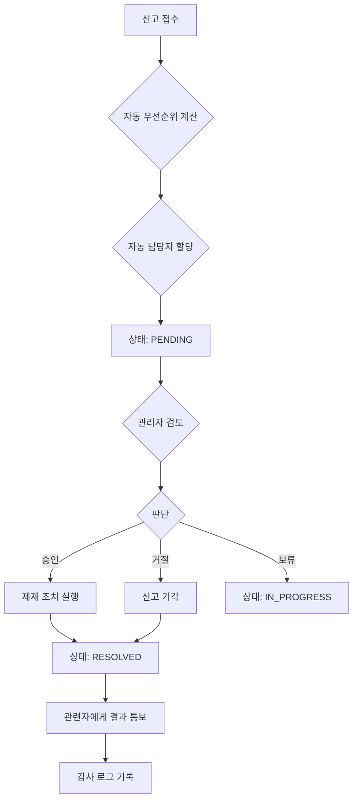

# 관리자 기능 - 신고 관리 상세 명세

> **작성일**: 2025-11-27
> **수정일**: 2025-11-28
> **영역**: Report Management
> **우선순위**: P0 (최우선)

---

## 1. 기능 개요

### 핵심 기능
1. **신고 접수 및 분류**: 자동 우선순위 계산
2. **신고 처리 워크플로우**: 검토 → 판단 → 조치 → 완료
3. **담당자 할당**: 자동/수동 할당
4. **제재 조치 실행**: 경고, 정지, 삭제, 기능 제한
5. **신고 통계**: 유형별, 처리 현황 분석

---

## 2. 신고 목록 페이지

### 필터 옵션
```typescript
{
  status: "PENDING" | "IN_PROGRESS" | "RESOLVED" | "REJECTED",
  priority: "LOW" | "MEDIUM" | "HIGH" | "URGENT",
  type: "SPAM" | "HARASSMENT" | "INAPPROPRIATE" | "COPYRIGHT" | "OTHER",
  targetType: "USER" | "STUDY" | "MESSAGE",
  assignedTo: string,  // 담당자 ID
  dateFrom: string,
  dateTo: string
}
```

### 신고 카드 UI
```
🔴 URGENT | #12345 | 2시간 전
유형: HARASSMENT (괴롭힘)
대상: 사용자 user123
신고자: reporter456
내용: "반복적인 욕설 및 협박 메시지 발송..."
[상세보기] [빠른 처리: 승인 | 거절]
```

---

## 3. 신고 상세 페이지 (3단 레이아웃)

### 왼쪽: 신고 정보 + 대상 정보
### 중앙: 증거 자료 + 피신고자 이력
### 우측: 처리 액션

---

## 4. 신고 처리 워크플로우

### 4.1 워크플로우 다이어그램



### 4.2 우선순위 자동 계산 알고리즘 상세

신고가 접수되면 `calculateReportPriority` 함수가 호출되어, 여러 요소를 기반으로 점수를 계산하고 우선순위를 결정합니다. 이 점수는 관리자가 어떤 신고를 먼저 처리해야 할지 판단하는 데 도움을 줍니다.

**평가 항목:**
| 항목 | 최대 점수 | 설명 |
|---|---|---|
| **신고 유형 심각도** | 30점 | 내용의 심각성에 따라 차등 부여 (괴롭힘 > 부적절 > 스팸) |
| **피신고자 이력** | 40점 | 과거 제재(경고, 정지) 횟수가 많을수록 높은 점수 부여 |
| **신고 빈도** | 20점 | 단기간(예: 7일) 내에 동일 대상에 대한 신고가 많을수록 높은 점수 부여 |
| **증거 자료 품질** | 10점 | 스크린샷, 상세 설명 등 구체적인 증거가 있을수록 높은 점수 부여 |

**구현 예시:**
```javascript
function calculateReportPriority(report, targetUser, recentReports) {
  let score = 0;
  
  // 1. 신고 유형 심각도 (0-30점)
  switch (report.type) {
    case 'HARASSMENT': score += 30; break;
    case 'INAPPROPRIATE': score += 20; break;
    case 'SPAM': score += 10; break;
    default: score += 5;
  }
  
  // 2. 피신고자 이력 (0-40점)
  score += (targetUser.warningCount || 0) * 5; // 경고 1회당 5점
  score += (targetUser.suspensionCount || 0) * 15; // 정지 1회당 15점

  // 3. 신고 빈도 (0-20점)
  score += Math.min(recentReports.length * 5, 20); // 최근 신고 1건당 5점, 최대 20점

  // 4. 증거 자료 품질 (0-10점)
  if (report.evidence?.screenshots?.length > 0) score += 5;
  if (report.evidence?.description?.length > 100) score += 5;
  
  // 최종 우선순위 결정
  if (score >= 70) return 'URGENT';
  if (score >= 50) return 'HIGH';
  if (score >= 30) return 'MEDIUM';
  return 'LOW';
}
```

### 4.3 자동 담당자 할당 로직

신규 신고가 접수되고 우선순위 계산이 끝나면, 처리할 담당자를 자동으로 할당할 수 있습니다. 이는 팀의 업무 부담을 균등하게 분배하고 신속한 처리를 돕습니다.

**할당 정책:**
1.  **라운드 로빈(Round-robin)**: 온라인 상태인 관리자 목록을 순서대로 순회하며 담당자를 할당합니다. 가장 간단하고 일반적인 방식입니다.
2.  **업무량 기반(Load-based)**: 현재 처리 중인 신고 건수가 가장 적은 관리자에게 할당합니다.
3.  **전문 분야 기반(Specialization-based)**: 신고 유형(예: 저작권, 기술적 문제)에 따라 해당 분야 전문 관리자에게 할당합니다.

**구현 예시 (라운드 로빈):**
Redis와 같은 외부 저장소를 사용하여 마지막으로 할당받은 관리자의 인덱스를 저장합니다.

```javascript
async function assignReportToAdmin(report) {
  // 1. 현재 온라인이며, 신고 처리 권한이 있는 관리자 목록 조회
  const availableAdmins = await getAvailableAdmins();
  if (availableAdmins.length === 0) return null; // 할당할 관리자 없음

  // 2. Redis에서 마지막 할당 인덱스 가져오기
  let lastIndex = await redis.get('last_report_admin_index') || -1;
  
  // 3. 다음 관리자 인덱스 계산
  const nextIndex = (parseInt(lastIndex) + 1) % availableAdmins.length;
  
  // 4. 다음 담당자 지정
  const assignedAdmin = availableAdmins[nextIndex];

  // 5. 신고 정보에 담당자 ID 업데이트
  await prisma.report.update({
    where: { id: report.id },
    data: { assignedToId: assignedAdmin.id },
  });

  // 6. Redis에 다음 인덱스 저장
  await redis.set('last_report_admin_index', nextIndex);
  
  // 7. 담당자에게 알림 발송 (Slack, 이메일 등)
  // ...
}
```

---

## 5. 제재 조치

### 제재 옵션
1. **경고 (WARNING)**: 경고 메시지 발송
2. **계정 정지 (SUSPEND)**: 1일/3일/7일/30일/영구
3. **기능 제한 (RESTRICT)**: 특정 기능만 차단
4. **콘텐츠 삭제 (DELETE)**: 메시지, 파일, 스터디 삭제
5. **신고 기각 (REJECT)**: 신고 내용 부적절

### 신고 처리 모달
```tsx
<ProcessReportModal report={report}>
  <h2>신고 처리</h2>
  
  {/* 추천 조치 (AI 기반) */}
  <RecommendedAction>
    💡 추천: 7일 정지 (이전 제재 2회)
  </RecommendedAction>
  
  {/* 처리 결정 */}
  <RadioGroup value={decision}>
    <Radio value="approve">✅ 승인 (제재 조치 실행)</Radio>
    <Radio value="reject">❌ 거절 (신고 기각)</Radio>
    <Radio value="hold">⏸ 보류 (추가 조사 필요)</Radio>
  </RadioGroup>
  
  {/* 제재 유형 선택 (승인 시) */}
  {decision === 'approve' && (
    <Select value={sanctionType}>
      <option value="WARNING">경고 발송</option>
      <option value="SUSPEND_3D">3일 정지</option>
      <option value="SUSPEND_7D">7일 정지 (권장)</option>
      <option value="SUSPEND_30D">30일 정지</option>
      <option value="RESTRICT">기능 제한</option>
      <option value="DELETE">콘텐츠 삭제</option>
    </Select>
  )}
  
  {/* 처리 사유 */}
  <Textarea 
    placeholder="처리 사유를 입력하세요"
    value={resolution}
  />
  
  {/* 알림 옵션 */}
  <Checkbox>신고자에게 처리 결과 통보</Checkbox>
  <Checkbox>피신고자에게 제재 통보</Checkbox>
  
  <Button onClick={submitProcess}>처리 완료</Button>
</ProcessReportModal>
```

---

## 6. 신고 통계

### 대시보드 위젯
```tsx
<ReportStatsWidget>
  <StatCard title="총 신고" value={totalReports} />
  <StatCard title="처리 대기" value={pendingReports} trend="up" />
  <StatCard title="평균 처리 시간" value="4.5시간" trend="down" />
  <StatCard title="처리율" value="95%" />
  
  <Chart title="신고 유형별 분포">
    SPAM: 40%
    HARASSMENT: 30%
    INAPPROPRIATE: 20%
    OTHER: 10%
  </Chart>
  
  <Chart title="주간 신고 추이">
    [7일간 신고 건수 그래프]
  </Chart>
</ReportStatsWidget>
```

---

## 7. API 명세

```http
GET    /api/admin/reports                   # 신고 목록
GET    /api/admin/reports/:id               # 신고 상세
POST   /api/admin/reports/:id/assign        # 담당자 할당
POST   /api/admin/reports/:id/process       # 신고 처리
GET    /api/admin/reports/statistics        # 신고 통계
```

---

**문서 버전**: 1.1 (보강)
**작성 완료일**: 2025-11-28

