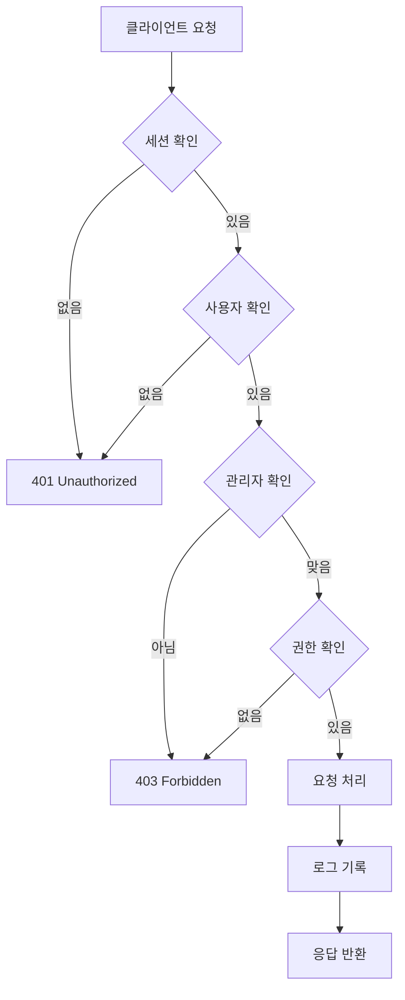

# CoUp 관리자 기능 예외 처리 가이드

**작성일**: 2025-11-29  
**버전**: 1.0.0  
**카테고리**: 관리자 (Admin)  
**우선순위**: 🔴 최고 (보안 및 권한 관리)

---

## 📋 목차

1. [개요](#개요)
2. [문서 구조](#문서-구조)
3. [주요 기능](#주요-기능)
4. [보안 및 권한](#보안-및-권한)
5. [핵심 예외 상황](#핵심-예외-상황)
6. [문서 인덱스](#문서-인덱스)
7. [빠른 참조](#빠른-참조)

---

## 개요

### 관리자 기능이란?

CoUp의 관리자 기능은 시스템 전체를 관리하고 모니터링하는 강력한 도구입니다:

- **사용자 관리**: 사용자 활성화, 정지, 삭제, 제재
- **스터디 관리**: 스터디 승인, 거절, 강제 종료
- **신고 처리**: 신고 목록 조회, 처리, 우선순위 관리
- **통계 및 분석**: 대시보드, 차트, 트렌드 분석
- **시스템 설정**: 전역 설정, 공지사항, 캐시 관리
- **로그 관리**: 관리자 액션 로그, 감사 추적
- **권한 관리**: 역할 기반 접근 제어 (RBAC)

### 왜 중요한가?

관리자 기능은 다음과 같은 이유로 특별히 중요합니다:

1. **보안**: 권한이 없는 사용자의 접근 차단 필수
2. **감사**: 모든 관리자 행동 로깅 및 추적 필요
3. **책임**: 잘못된 조치의 영향이 전체 시스템에 미침
4. **규정 준수**: GDPR, 개인정보보호법 등 법적 요구사항
5. **신뢰**: 사용자 데이터 보호와 공정한 운영

### 특별한 고려사항

- **모든 API는 관리자 권한 검증 필수**
- **모든 행동은 감사 로그에 기록**
- **민감한 정보는 마스킹 처리**
- **중요 작업은 확인 단계 필수**
- **롤백 메커니즘 고려**

---

## 문서 구조

이 디렉토리는 관리자 기능의 예외 처리를 다음과 같이 구조화합니다:

```
docs/exception/admin/
├── README.md                          # 이 파일 (개요 및 가이드)
├── INDEX.md                           # 전체 예외 상황 색인
├── 01-user-management.md              # 사용자 관리 예외
├── 02-study-management.md             # 스터디 관리 예외
├── 03-report-handling.md              # 신고 처리 예외
├── 04-analytics-stats.md              # 통계/분석 예외
├── 05-system-settings.md              # 시스템 설정 예외
├── 06-audit-logs.md                   # 로그 관리 예외
├── 07-permissions-rbac.md             # 권한 관리 예외
├── 08-edge-cases.md                   # 엣지 케이스
└── 99-best-practices.md               # 모범 사례
```

---

## 주요 기능

### 1. 사용자 관리 (User Management)

**API 엔드포인트**:
```
GET    /api/admin/users              # 사용자 목록
GET    /api/admin/users/[id]         # 사용자 상세
PATCH  /api/admin/users/[id]         # 사용자 수정
DELETE /api/admin/users/[id]         # 사용자 삭제
POST   /api/admin/users/[id]/suspend # 사용자 정지
POST   /api/admin/users/[id]/activate # 사용자 활성화
```

**주요 예외**:
- 자기 자신 수정/삭제 시도
- 다른 관리자에 대한 작업
- 이미 처리된 상태 중복 처리
- 권한 부족

**참조 문서**: `01-user-management.md`

---

### 2. 스터디 관리 (Study Management)

**API 엔드포인트**:
```
GET    /api/admin/studies                  # 스터디 목록
GET    /api/admin/studies/[id]             # 스터디 상세
PATCH  /api/admin/studies/[id]             # 스터디 수정
POST   /api/admin/studies/[id]/close       # 스터디 강제 종료
POST   /api/admin/studies/[id]/hide        # 스터디 숨기기
DELETE /api/admin/studies/[id]             # 스터디 삭제
```

**주요 예외**:
- 활성 멤버가 있는 스터디 종료
- 이미 종료된 스터디 재처리
- 스터디 데이터 불일치
- 연관 데이터 정리 실패

**참조 문서**: `02-study-management.md`

---

### 3. 신고 처리 (Report Handling)

**API 엔드포인트**:
```
GET    /api/admin/reports              # 신고 목록
GET    /api/admin/reports/[id]         # 신고 상세
PATCH  /api/admin/reports/[id]         # 신고 처리
POST   /api/admin/reports/[id]/action  # 제재 조치
```

**주요 예외**:
- 신고 대상이 삭제된 경우
- 중복 신고 처리
- 처리자 충돌 (동시 처리)
- 제재 이력 관리

**참조 문서**: `03-report-handling.md`

---

### 4. 통계 및 분석 (Analytics & Stats)

**API 엔드포인트**:
```
GET /api/admin/stats                    # 기본 통계
GET /api/admin/analytics/overview       # 전체 개요
GET /api/admin/analytics/users          # 사용자 분석
GET /api/admin/analytics/studies        # 스터디 분석
```

**주요 예외**:
- 대량 데이터 쿼리 타임아웃
- 날짜 범위 오류
- 집계 계산 오류
- 캐시 불일치

**참조 문서**: `04-analytics-stats.md`

---

### 5. 시스템 설정 (System Settings)

**API 엔드포인트**:
```
GET  /api/admin/settings                 # 설정 조회
PUT  /api/admin/settings                 # 설정 업데이트
GET  /api/admin/settings/history         # 설정 이력
POST /api/admin/settings/cache/clear     # 캐시 초기화
```

**주요 예외**:
- 유효하지 않은 설정 값
- 타입 불일치
- 순환 의존성
- 캐시 동기화 실패

**참조 문서**: `05-system-settings.md`

---

### 6. 로그 관리 (Audit Logs)

**API 엔드포인트**:
```
GET  /api/admin/audit-logs        # 로그 조회
GET  /api/admin/audit-logs/export # 로그 내보내기
```

**주요 예외**:
- 대량 로그 조회 성능
- 로그 저장 실패
- 민감 정보 노출
- 로그 필터링 오류

**참조 문서**: `06-audit-logs.md`

---

### 7. 권한 관리 (Permissions & RBAC)

**핵심 개념**:
```javascript
// 권한 체계
const PERMISSIONS = {
  USER_VIEW: 'user:view',
  USER_EDIT: 'user:edit',
  USER_DELETE: 'user:delete',
  STUDY_VIEW: 'study:view',
  STUDY_EDIT: 'study:edit',
  STUDY_DELETE: 'study:delete',
  REPORT_VIEW: 'report:view',
  REPORT_PROCESS: 'report:process',
  ANALYTICS_VIEW: 'analytics:view',
  SETTINGS_VIEW: 'settings:view',
  SETTINGS_UPDATE: 'settings:update',
  AUDIT_VIEW: 'audit:view',
}

// 역할별 권한
SUPER_ADMIN: 모든 권한
ADMIN: 대부분 권한 (settings:update 제외)
MODERATOR: 보기 및 신고 처리만
```

**주요 예외**:
- 권한 부족
- 만료된 세션
- 역할 변경 후 권한 불일치
- 순환 권한 참조

**참조 문서**: `07-permissions-rbac.md`

---

## 보안 및 권한

### 인증 흐름



### 권한 검증 코드

```javascript
// lib/admin/auth.js
export async function requireAdmin(request, requiredPermission) {
  // 1. 세션 확인
  const session = await getServerSession(authOptions)
  if (!session?.user?.id) {
    return NextResponse.json(
      { error: '인증이 필요합니다' },
      { status: 401 }
    )
  }

  // 2. 관리자 역할 확인
  const adminRole = await prisma.adminRole.findUnique({
    where: { userId: session.user.id },
    include: { user: true }
  })

  if (!adminRole) {
    return NextResponse.json(
      { error: '관리자 권한이 없습니다' },
      { status: 403 }
    )
  }

  // 3. 특정 권한 확인
  if (requiredPermission && !hasPermission(adminRole, requiredPermission)) {
    return NextResponse.json(
      { error: '해당 작업을 수행할 권한이 없습니다' },
      { status: 403 }
    )
  }

  return { adminRole }
}
```

### 로깅 코드

```javascript
// lib/admin/auth.js
export async function logAdminAction({
  adminId,
  action,
  targetType,
  targetId,
  details,
  request,
}) {
  await prisma.adminLog.create({
    data: {
      adminId,
      action,
      targetType,
      targetId,
      details,
      ipAddress: request.headers.get('x-forwarded-for') || 'unknown',
      userAgent: request.headers.get('user-agent') || 'unknown',
    }
  })
}
```

---

## 핵심 예외 상황

### 1. 권한 관련 예외

| 예외 | 설명 | 해결 방법 |
|------|------|-----------|
| **AUTH001** | 세션 없음 | 로그인 페이지로 리다이렉트 |
| **AUTH002** | 관리자 아님 | 403 에러 표시 |
| **AUTH003** | 권한 부족 | 필요 권한 안내 |
| **AUTH004** | 세션 만료 | 재로그인 요청 |
| **AUTH005** | IP 제한 | 관리자 연락 안내 |

### 2. 데이터 작업 예외

| 예외 | 설명 | 해결 방법 |
|------|------|-----------|
| **DATA001** | 대상 없음 | 404 에러 + 목록 새로고침 |
| **DATA002** | 중복 처리 | 현재 상태 표시 |
| **DATA003** | 동시성 충돌 | 낙관적 락 사용 |
| **DATA004** | 트랜잭션 실패 | 롤백 + 재시도 |
| **DATA005** | 외래 키 제약 | 의존성 먼저 처리 |

### 3. 비즈니스 로직 예외

| 예외 | 설명 | 해결 방법 |
|------|------|-----------|
| **BIZ001** | 자기 자신 수정 | 다른 관리자 요청 |
| **BIZ002** | 마지막 관리자 삭제 | 삭제 방지 |
| **BIZ003** | 활성 스터디 종료 | 멤버 통보 후 종료 |
| **BIZ004** | 처리 완료 신고 재처리 | 현재 상태 표시 |
| **BIZ005** | 유효하지 않은 설정 | 검증 + 기본값 |

### 4. 성능 관련 예외

| 예외 | 설명 | 해결 방법 |
|------|------|-----------|
| **PERF001** | 대량 데이터 쿼리 | 페이지네이션 강제 |
| **PERF002** | 느린 집계 | 캐시 사용 |
| **PERF003** | 타임아웃 | 쿼리 최적화 |
| **PERF004** | 메모리 부족 | 스트리밍 처리 |
| **PERF005** | 잦은 로그 쓰기 | 배치 처리 |

---

## 문서 인덱스

각 문서는 특정 영역의 예외 처리를 상세히 다룹니다:

### 1. [사용자 관리](./01-user-management.md)
- 사용자 목록 조회 예외
- 사용자 상세 조회 예외
- 사용자 정지/활성화 예외
- 사용자 삭제 예외
- 경고 및 제재 관리

### 2. [스터디 관리](./02-study-management.md)
- 스터디 목록 조회 예외
- 스터디 상세 조회 예외
- 스터디 강제 종료 예외
- 스터디 숨기기/삭제 예외
- 멤버 관리 예외

### 3. [신고 처리](./03-report-handling.md)
- 신고 목록 조회 예외
- 신고 상세 조회 예외
- 신고 처리 예외
- 제재 조치 예외
- 신고 우선순위 관리

### 4. [통계 및 분석](./04-analytics-stats.md)
- 전체 통계 조회 예외
- 사용자 분석 예외
- 스터디 분석 예외
- 차트 데이터 예외
- 성능 최적화

### 5. [시스템 설정](./05-system-settings.md)
- 설정 조회 예외
- 설정 업데이트 예외
- 설정 검증 예외
- 캐시 관리 예외
- 설정 이력 관리

### 6. [로그 관리](./06-audit-logs.md)
- 로그 조회 예외
- 로그 필터링 예외
- 로그 내보내기 예외
- 민감 정보 마스킹
- 로그 보관 정책

### 7. [권한 관리](./07-permissions-rbac.md)
- 권한 검증 예외
- 역할 관리 예외
- 권한 상속 예외
- 세션 관리 예외
- IP 제한 예외

### 8. [엣지 케이스](./08-edge-cases.md)
- 극한 상황 (대량 데이터)
- 동시성 문제
- 네트워크 장애
- 데이터베이스 장애
- 타사 서비스 장애

### 9. [모범 사례](./99-best-practices.md)
- 보안 체크리스트
- 코드 리뷰 가이드
- 테스트 전략
- 모니터링 및 알림
- 운영 가이드

---

## 빠른 참조

### 자주 발생하는 문제

#### 1. "관리자 권한이 없습니다" (403)

**원인**:
- 일반 사용자가 관리자 페이지 접근
- 권한이 없는 관리자가 특정 작업 시도

**해결**:
```javascript
// 1. 관리자 여부 확인
const admin = await prisma.adminRole.findUnique({
  where: { userId: session.user.id }
})

if (!admin) {
  // 일반 사용자 - 홈으로 리다이렉트
  redirect('/')
}

// 2. 특정 권한 확인
if (!hasPermission(admin, 'USER_DELETE')) {
  // 권한 없음 - 안내 메시지
  toast.error('사용자 삭제 권한이 없습니다')
}
```

#### 2. "자기 자신을 수정/삭제할 수 없습니다"

**원인**:
- 관리자가 자신의 계정 조작 시도

**해결**:
```javascript
// API에서 검증
if (targetUserId === session.user.id) {
  return NextResponse.json(
    { error: '자기 자신을 수정할 수 없습니다' },
    { status: 400 }
  )
}

// UI에서 비활성화
<button
  disabled={user.id === session.user.id}
  onClick={handleSuspend}
>
  정지
</button>
```

#### 3. "로그 기록 실패" 경고

**원인**:
- 데이터베이스 연결 문제
- 로그 테이블 용량 초과
- 유효하지 않은 데이터

**해결**:
```javascript
// 비동기 로깅 (실패해도 요청 처리 계속)
async function safeLogAdminAction(data) {
  try {
    await logAdminAction(data)
  } catch (error) {
    console.error('로그 기록 실패:', error)
    // 별도 로깅 시스템으로 폴백
    await fallbackLogger.log(data)
  }
}

// 메인 로직은 영향 받지 않음
const result = await updateUser(...)
await safeLogAdminAction({ ... })
return result
```

#### 4. "통계 조회 타임아웃"

**원인**:
- 대량 데이터 집계
- 복잡한 JOIN 쿼리
- 인덱스 부족

**해결**:
```javascript
// 1. 캐시 사용
const cachedStats = await redis.get('admin:stats:overview')
if (cachedStats) {
  return JSON.parse(cachedStats)
}

const stats = await calculateStats()
await redis.setex('admin:stats:overview', 300, JSON.stringify(stats))

// 2. 페이지네이션
const limit = Math.min(searchParams.get('limit') || 20, 100)

// 3. 인덱스 추가
// schema.prisma
@@index([createdAt, status])
@@index([userId, action])
```

#### 5. "설정 업데이트 후 캐시 불일치"

**원인**:
- 여러 인스턴스에서 캐시 사용
- 캐시 무효화 실패

**해결**:
```javascript
// Redis pub/sub로 전체 인스턴스 캐시 무효화
async function updateSettings(settings) {
  await prisma.systemSetting.updateMany(...)
  
  // 모든 인스턴스에 알림
  await redis.publish('settings:invalidate', JSON.stringify({
    timestamp: Date.now()
  }))
}

// 각 인스턴스는 구독
redis.subscribe('settings:invalidate')
redis.on('message', (channel, message) => {
  if (channel === 'settings:invalidate') {
    settingsCache = null
  }
})
```

---

## 긴급 상황 대응

### 관리자 계정 잠김

```bash
# 스크립트로 관리자 활성화
node scripts/activate-users.js --email admin@example.com

# 또는 직접 DB 수정
psql -U postgres -d coup
UPDATE "User" SET status = 'ACTIVE' WHERE email = 'admin@example.com';
```

### 모든 관리자가 삭제됨

```bash
# 긴급 관리자 생성
node scripts/create-test-admin.js \
  --email emergency@coup.com \
  --password secure_password \
  --role SUPER_ADMIN
```

### 설정 오류로 시스템 다운

```bash
# 설정 롤백
node scripts/rollback-settings.js --to-version 1.2.3

# 또는 기본값으로 리셋
node scripts/reset-settings.js --confirm
```

### 대량 스팸 신고

```bash
# 일괄 신고 거절
node scripts/bulk-reject-reports.js \
  --from "2025-11-29 00:00" \
  --to "2025-11-29 23:59" \
  --reason "spam"
```

---

## 추가 리소스

### 관련 문서
- [관리자 기능 최종 가이드](../../admin/FINAL-README.md)
- [관리자 운영 매뉴얼](../../admin/OPERATIONS-MANUAL.md)
- [API 엔드포인트 문서](../../admin/API-ENDPOINTS.md)

### 코드 위치
- **API**: `src/app/api/admin/**`
- **페이지**: `src/app/admin/**`
- **컴포넌트**: `src/components/admin/**`
- **유틸**: `src/lib/admin/**`
- **스크립트**: `scripts/**`

### 테스트 도구
- **관리자 생성**: `scripts/create-test-admin.js`
- **사용자 상태 확인**: `scripts/check-user-status.js`
- **로그인 테스트**: `scripts/test-login.js`

---

## 기여 가이드

문서 개선 제안이나 새로운 예외 케이스 발견 시:

1. 해당 문서 파일 수정
2. INDEX.md에 예외 코드 추가
3. 이 README의 빠른 참조 업데이트
4. 실제 코드 예제 포함

---

**다음 문서**: [전체 색인 (INDEX.md)](./INDEX.md)

