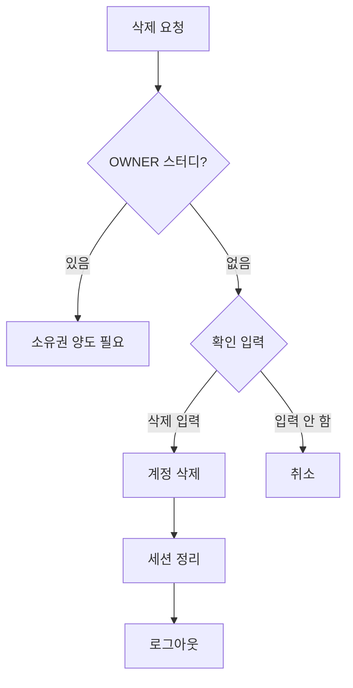

# 계정 삭제 예외 처리

**작성일**: 2025-11-29  
**카테고리**: Profile Management - Account Deletion  
**난이도**: ⭐⭐⭐⭐ (고급)

---

## 📋 목차

1. [개요](#개요)
2. [계정 삭제 프로세스](#계정-삭제-프로세스)
3. [OWNER 스터디 처리](#owner-스터디-처리)
4. [데이터 정리 예외](#데이터-정리-예외)
5. [복구 불가 확인](#복구-불가-확인)
6. [모범 사례](#모범-사례)

---

## 개요

계정 삭제는 민감한 작업으로, 사용자의 모든 데이터를 안전하게 처리해야 합니다. 특히 OWNER로 있는 스터디, 연관된 데이터, 복구 불가 확인 등을 신중하게 다뤄야 합니다.

### 삭제 방식

CoUp은 **소프트 삭제(Soft Delete)** 방식을 사용합니다:
- 계정 상태를 `DELETED`로 변경
- 이메일을 `deleted_{userId}@deleted.com`으로 변경
- 실제 데이터는 일정 기간 보관

---

## 계정 삭제 프로세스

### 1.1 삭제 흐름



### 1.2 구현

**클라이언트 (src/components/my-page/DeleteAccountModal.jsx)**:
```javascript
'use client'

import { useState } from 'react'
import { signOut } from 'next-auth/react'
import { useRouter } from 'next/navigation'
import toast from 'react-hot-toast'

export default function DeleteAccountModal({ onClose }) {
  const router = useRouter()
  const [inputValue, setInputValue] = useState('')
  const [isDeleting, setIsDeleting] = useState(false)
  const [ownerStudies, setOwnerStudies] = useState([])
  const [loading, setLoading] = useState(true)

  // OWNER 스터디 확인
  useEffect(() => {
    checkOwnerStudies()
  }, [])

  const checkOwnerStudies = async () => {
    try {
      const response = await fetch('/api/users/me/owner-studies')
      const data = await response.json()
      
      if (data.success) {
        setOwnerStudies(data.studies || [])
      }
    } catch (error) {
      console.error('Check owner studies error:', error)
    } finally {
      setLoading(false)
    }
  }

  const handleDelete = async () => {
    if (inputValue !== '삭제') {
      toast.error('"삭제"를 정확히 입력해주세요')
      return
    }

    if (ownerStudies.length > 0) {
      toast.error('OWNER인 스터디의 소유권을 먼저 양도해주세요')
      return
    }

    try {
      setIsDeleting(true)

      const response = await fetch('/api/users/me', {
        method: 'DELETE'
      })

      if (!response.ok) {
        const error = await response.json()
        throw new Error(error.error || '계정 삭제 실패')
      }

      toast.success('계정이 삭제되었습니다')

      // 로그아웃
      await signOut({ callbackUrl: '/' })

    } catch (error) {
      console.error('Delete account error:', error)
      toast.error(error.message || '계정 삭제에 실패했습니다')
    } finally {
      setIsDeleting(false)
    }
  }

  if (loading) {
    return <div>확인 중...</div>
  }

  return (
    <div className="modal-overlay" onClick={onClose}>
      <div className="modal" onClick={(e) => e.stopPropagation()}>
        <h2>계정 삭제 확인</h2>

        {/* OWNER 스터디 경고 */}
        {ownerStudies.length > 0 && (
          <div className="warning-box">
            <h3>⚠️ 소유권을 양도해야 합니다</h3>
            <p>다음 스터디의 OWNER입니다:</p>
            <ul>
              {ownerStudies.map(study => (
                <li key={study.id}>
                  <strong>{study.name}</strong>
                  <br />
                  <button
                    onClick={() => router.push(`/my-studies/${study.id}/settings?tab=transfer`)}
                    className="link-button"
                  >
                    소유권 양도하기 →
                  </button>
                </li>
              ))}
            </ul>
          </div>
        )}

        <div className="info-box">
          <h3>삭제되는 데이터:</h3>
          <ul>
            <li>✓ 프로필 정보 (이름, 이메일, 아바타, 자기소개)</li>
            <li>✓ 참여 중인 모든 스터디 정보</li>
            <li>✓ 작성한 공지사항, 댓글, 채팅 메시지</li>
            <li>✓ 업로드한 파일</li>
            <li>✓ 할일 및 활동 기록</li>
          </ul>
        </div>

        <div className="danger-box">
          <p>⚠️ 이 작업은 되돌릴 수 없습니다</p>
        </div>

        <form onSubmit={(e) => { e.preventDefault(); handleDelete() }}>
          <label>
            삭제하려면 <strong>"삭제"</strong>를 입력하세요:
          </label>
          <input
            type="text"
            value={inputValue}
            onChange={(e) => setInputValue(e.target.value)}
            placeholder="삭제"
            disabled={ownerStudies.length > 0}
            autoFocus
          />

          <div className="button-group">
            <button
              type="button"
              onClick={onClose}
              className="button-secondary"
            >
              취소
            </button>
            <button
              type="submit"
              disabled={isDeleting || inputValue !== '삭제' || ownerStudies.length > 0}
              className="button-danger"
            >
              {isDeleting ? '삭제 중...' : '계정 삭제'}
            </button>
          </div>
        </form>
      </div>
    </div>
  )
}
```

**서버 (src/app/api/users/me/route.js - DELETE)**:
```javascript
import { NextResponse } from "next/server"
import { requireAuth } from "@/lib/auth-helpers"
import { prisma } from "@/lib/prisma"

export async function DELETE() {
  const session = await requireAuth()
  if (session instanceof NextResponse) return session

  try {
    const userId = session.user.id

    // 1. OWNER 스터디 확인
    const ownerStudies = await prisma.study.findMany({
      where: {
        members: {
          some: {
            userId,
            role: 'OWNER'
          }
        }
      }
    })

    if (ownerStudies.length > 0) {
      return NextResponse.json(
        { 
          error: "OWNER인 스터디의 소유권을 먼저 양도해주세요",
          ownerStudies: ownerStudies.map(s => ({ id: s.id, name: s.name }))
        },
        { status: 400 }
      )
    }

    // 2. 트랜잭션으로 처리
    await prisma.$transaction(async (tx) => {
      // 2-1. 스터디 멤버 삭제
      await tx.studyMember.deleteMany({
        where: { userId }
      })

      // 2-2. 할일 삭제
      await tx.task.deleteMany({
        where: { assigneeId: userId }
      })

      // 2-3. 알림 삭제
      await tx.notification.deleteMany({
        where: { userId }
      })

      // 2-4. 파일 삭제 (소프트)
      await tx.file.updateMany({
        where: { uploaderId: userId },
        data: { isDeleted: true }
      })

      // 2-5. 댓글 삭제 (소프트)
      await tx.comment.updateMany({
        where: { authorId: userId },
        data: { isDeleted: true }
      })

      // 2-6. 계정 상태 변경 (소프트 삭제)
      await tx.user.update({
        where: { id: userId },
        data: {
          status: 'DELETED',
          email: `deleted_${userId}@deleted.com`,
          name: `삭제된 사용자`,
          avatar: null,
          bio: null,
          deletedAt: new Date()
        }
      })
    })

    return NextResponse.json({
      success: true,
      message: "계정이 삭제되었습니다"
    })

  } catch (error) {
    console.error('Delete account error:', error)
    
    return NextResponse.json(
      { error: "계정 삭제 중 오류가 발생했습니다" },
      { status: 500 }
    )
  }
}
```

---

## OWNER 스터디 처리

### 2.1 OWNER 스터디 확인 API

```javascript
// src/app/api/users/me/owner-studies/route.js
import { NextResponse } from "next/server"
import { requireAuth } from "@/lib/auth-helpers"
import { prisma } from "@/lib/prisma"

export async function GET() {
  const session = await requireAuth()
  if (session instanceof NextResponse) return session

  try {
    const studies = await prisma.study.findMany({
      where: {
        members: {
          some: {
            userId: session.user.id,
            role: 'OWNER'
          }
        }
      },
      select: {
        id: true,
        name: true,
        _count: {
          select: {
            members: true
          }
        }
      }
    })

    return NextResponse.json({
      success: true,
      studies
    })

  } catch (error) {
    console.error('Get owner studies error:', error)
    return NextResponse.json(
      { error: "스터디 조회 실패" },
      { status: 500 }
    )
  }
}
```

### 2.2 소유권 양도

```javascript
// src/app/api/studies/[studyId]/transfer-ownership/route.js
export async function POST(request, { params }) {
  const session = await requireAuth()
  if (session instanceof NextResponse) return session

  try {
    const { studyId } = params
    const { newOwnerId } = await request.json()

    // 현재 사용자가 OWNER인지 확인
    const currentMember = await prisma.studyMember.findFirst({
      where: {
        studyId,
        userId: session.user.id,
        role: 'OWNER'
      }
    })

    if (!currentMember) {
      return NextResponse.json(
        { error: "소유권을 양도할 권한이 없습니다" },
        { status: 403 }
      )
    }

    // 새 소유자가 멤버인지 확인
    const newOwnerMember = await prisma.studyMember.findFirst({
      where: {
        studyId,
        userId: newOwnerId
      }
    })

    if (!newOwnerMember) {
      return NextResponse.json(
        { error: "새 소유자가 스터디 멤버가 아닙니다" },
        { status: 400 }
      )
    }

    // 트랜잭션으로 소유권 양도
    await prisma.$transaction([
      // 현재 소유자를 ADMIN으로 변경
      prisma.studyMember.update({
        where: { id: currentMember.id },
        data: { role: 'ADMIN' }
      }),
      // 새 소유자를 OWNER로 변경
      prisma.studyMember.update({
        where: { id: newOwnerMember.id },
        data: { role: 'OWNER' }
      })
    ])

    return NextResponse.json({
      success: true,
      message: "소유권이 양도되었습니다"
    })

  } catch (error) {
    console.error('Transfer ownership error:', error)
    return NextResponse.json(
      { error: "소유권 양도 실패" },
      { status: 500 }
    )
  }
}
```

---

## 데이터 정리 예외

### 3.1 연관 데이터 처리

**삭제 전략**:
```javascript
// 즉시 삭제
- studyMember (스터디 멤버십)
- task (할일)
- notification (알림)

// 소프트 삭제 (isDeleted = true)
- file (파일)
- comment (댓글)
- chatMessage (채팅 메시지)

// 익명화 처리
- user (계정 정보)
  - name: "삭제된 사용자"
  - email: "deleted_{userId}@deleted.com"
  - avatar: null
  - bio: null
```

### 3.2 파일 정리

```javascript
// 백그라운드 작업으로 파일 삭제
// src/jobs/cleanup-deleted-files.js
export async function cleanupDeletedFiles() {
  const deletedUsers = await prisma.user.findMany({
    where: {
      status: 'DELETED',
      deletedAt: {
        lt: new Date(Date.now() - 30 * 24 * 60 * 60 * 1000) // 30일 이전
      }
    }
  })

  for (const user of deletedUsers) {
    // 파일 삭제
    const files = await prisma.file.findMany({
      where: { uploaderId: user.id }
    })

    for (const file of files) {
      try {
        // 물리적 파일 삭제
        await unlink(join(process.cwd(), 'public', file.path))
        
        // DB 레코드 삭제
        await prisma.file.delete({
          where: { id: file.id }
        })
      } catch (error) {
        console.error(`File deletion error: ${file.id}`, error)
      }
    }
  }
}
```

---

## 복구 불가 확인

### 4.1 확인 프로세스

**단계별 확인**:
1. OWNER 스터디 확인
2. 삭제될 데이터 안내
3. "삭제" 텍스트 입력 요구
4. 최종 확인 버튼

**구현**:
```javascript
const [confirmStep, setConfirmStep] = useState(0)

const steps = [
  {
    title: '1단계: 스터디 확인',
    check: () => ownerStudies.length === 0,
    message: 'OWNER 스터디를 확인해주세요'
  },
  {
    title: '2단계: 데이터 확인',
    check: () => acknowledgedData,
    message: '삭제될 데이터를 확인해주세요'
  },
  {
    title: '3단계: 최종 확인',
    check: () => inputValue === '삭제',
    message: '"삭제"를 입력해주세요'
  }
]

const canProceed = steps.every(step => step.check())
```

---

## 모범 사례

### 1. 보안 강화

```javascript
// 비밀번호 재확인
const [password, setPassword] = useState('')

const handleDelete = async () => {
  // 비밀번호 확인
  const verified = await fetch('/api/auth/verify-password', {
    method: 'POST',
    body: JSON.stringify({ password })
  })

  if (!verified.ok) {
    toast.error('비밀번호가 일치하지 않습니다')
    return
  }

  // 계정 삭제
  // ...
}
```

### 2. 로깅

```javascript
// 계정 삭제 로그
await prisma.auditLog.create({
  data: {
    action: 'ACCOUNT_DELETED',
    userId,
    metadata: {
      deletedAt: new Date(),
      ownerStudiesCount: ownerStudies.length,
      totalStudiesCount: totalStudies
    }
  }
})
```

### 3. 이메일 알림

```javascript
// 삭제 확인 이메일 발송
await sendEmail({
  to: user.email,
  subject: 'CoUp 계정 삭제 확인',
  template: 'account-deleted',
  data: {
    name: user.name,
    deletedAt: new Date()
  }
})
```

---

## 관련 문서

- **[프로필 개요](./README.md)**
- **[프로필 수정](./01-profile-edit-exceptions.md)**
- **[모범 사례](./99-best-practices.md)**

---

**다음 문서**: [모범 사례 (99-best-practices.md)](./99-best-practices.md)  
**이전 문서**: [아바타 예외 (02-avatar-exceptions.md)](./02-avatar-exceptions.md)

